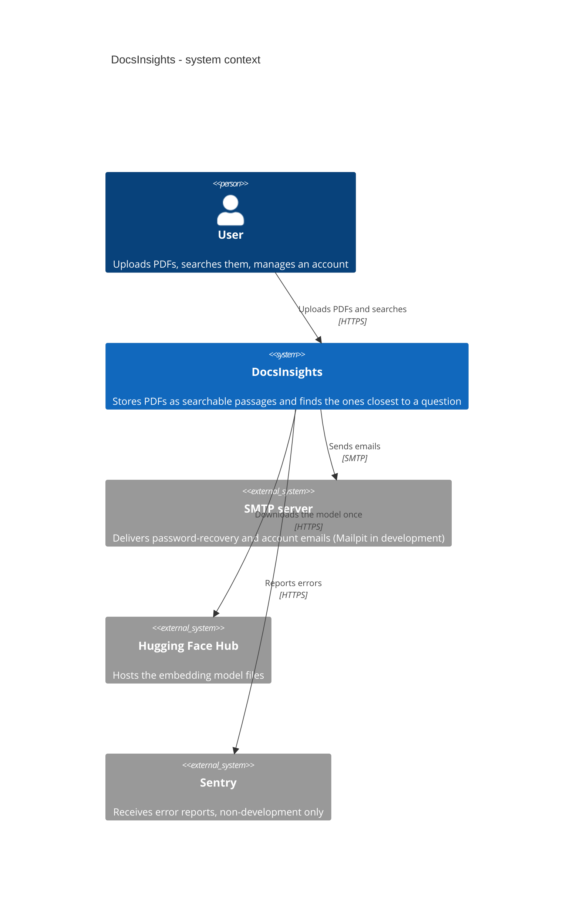
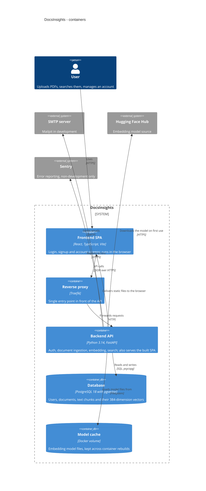
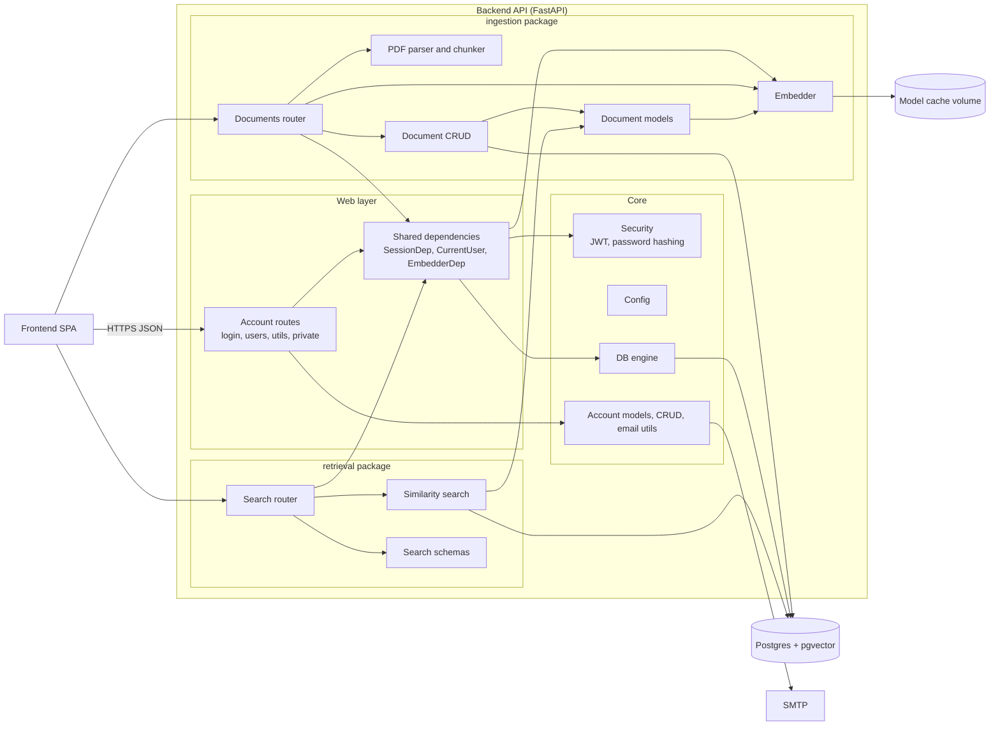
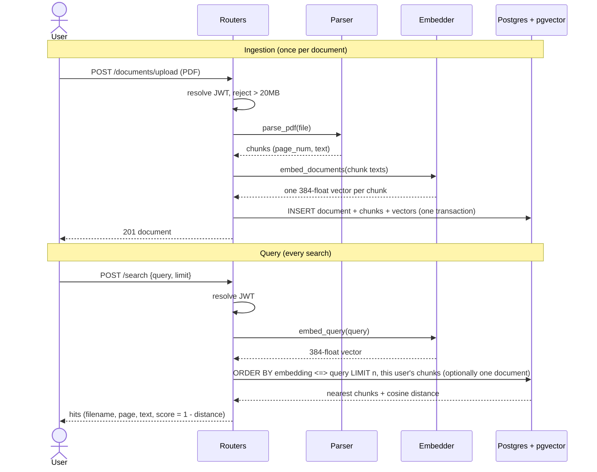

# C4 Architecture: Context, Containers, Components

Three zoom levels of the same system: who uses it (1), what runs (2), and what is inside the
backend (3). Describes the code as it is on the Phase 3 branch (search is built, not yet
released; see [roadmap](./roadmap.md) for what has shipped). Decisions live in [ADRs](./adr/).

Diagrams use Mermaid's native C4 syntax (levels 1-2), which GitHub renders but lays out
automatically, so box positions are not meaningful.

## Level 1: System context

## Level 2: Containers

The frontend has no document upload or search screens yet; those two features are API-only.

## Level 3: Backend components

Mermaid flowchart, not strict C4 notation, so it renders on GitHub without plugins.

## Components

| Component | Module | Responsibility |
| --- | --- | --- |
| Account routes | `app.api.routes.*` | Signup, login, token refresh, password reset, user CRUD; owner and superuser checks |
| Shared dependencies | `app.api.deps` | Per-request DB session, current user from JWT, process-wide embedder; the one place routers get these |
| Account models, CRUD, email utils | `app.models`, `app.crud`, `app.utils` | `User` table and schemas, authentication, email rendering and sending |
| Security | `app.core.security` | Access and refresh JWTs, Argon2/bcrypt hashing with upgrade |
| Config, DB engine | `app.core.config`, `app.core.db` | Settings from environment, SQLModel engine, first-superuser seed |
| Documents router | `app.ingestion.router` | Upload (20MB cap), list, get, delete; owner-scoped; maps parse failures to 422 |
| PDF parser and chunker | `app.ingestion.document_parser` | pypdf text extraction; 250-word windows with 50-word overlap; whitespace collapsed; typed errors for encrypted or unreadable PDFs |
| Embedder | `app.ingestion.embedder` | `Embedder` protocol, fastembed implementation, dimensions read from the model registry, cached per process, embeds in batches of 32 to bound memory |
| Document models, CRUD | `app.ingestion.models`, `app.ingestion.crud` | `Document` and `DocumentChunk` (with `vector(384)`), save document and chunks in one transaction |
| Search router | `app.retrieval.router` | `POST /search`: embed the query, return top hits for the current user, optionally limited to one `document_id` (404 if it is missing or not the caller's) |
| Similarity search | `app.retrieval.search` | Cosine-distance query over the owner's chunks, joined to filenames; score is `1 - distance` |
| Answer endpoint | `app.retrieval.router` | `POST /answer`: same search and 404 rules as `/search`, then the passages go to the answerer; returns the answer plus numbered sources matching its `[n]` citations. 503 without an API key, 502 if the model call fails |
| Answerer | `app.retrieval.answerer` | `Answerer` protocol and a Claude implementation; passages are escaped and numbered, the system prompt allows only cited, passage-based answers and treats passage text as untrusted |
| Review endpoint | `app.agentic_review.router` | `POST /documents/{id}/review`: ownership 404, then one finding per requirement; 503 without an API key, 502 if the model call fails |
| Review logic | `app.agentic_review.review` | Retrieves passages per requirement, gets a verdict, drops invented citations and downgrades ungrounded verdicts to `not_found` ([ADR-0007](./adr/0007-review-verdicts-must-cite-real-passages.md)) |
| Reviewer | `app.agentic_review.reviewer` | `Reviewer` protocol and a Claude implementation returning a schema-constrained `ReviewVerdict`; reuses the answerer's escaped, numbered passage format |

## End-to-end walkthrough: PDF in, passages out

The walkthrough below is the **retrieval** half: `POST /search` returns passages and stops.
`POST /answer` runs the same search, then sends the top passages to Claude for a cited answer
(single-shot; no reranker, no keyword leg).

### Stage by stage, with real numbers

Example: a 2-page job posting uploaded as `Data Engineer - Remote - Develocraft.pdf`.

| # | Stage | What happens | Real example |
| --- | --- | --- | --- |
| 1 | Auth and size gate | JWT decoded to a user; files over 20MB get 413 | `owner_id` is stamped on the document |
| 2 | Extract | pypdf pulls text per page; empty pages skipped; encrypted or corrupt PDFs become 422 | page 1: 274 words, page 2: 238 words |
| 3 | Normalize | All whitespace collapsed to single spaces (pypdf sometimes emits one word per line) | `time\nStart\nof` becomes `time Start of` |
| 4 | Chunk | Window of 250 words, step 200 (50-word overlap); shorter pages stay whole | page 1 becomes words 0-249 and words 200-273 (250 and 74 words); page 2 stays one chunk of 238 |
| 5 | Embed | bge-small turns each chunk into 384 floats; input over 512 tokens would be truncated, which is why chunks stop at 250 words | 3 vectors, each of length 1.0 |
| 6 | Store | `Document` row plus one `DocumentChunk` per window (text, page, vector) in one transaction | 3 chunk rows (the `documentchunk` table held 160kB for 8 chunks) |
| 7 | Embed the query | The same model embeds the search text, no prefix | `"aws"` becomes one 384-float vector, also length 1.0 |
| 8 | Compare | Postgres computes cosine distance (`<=>`) between the query vector and every chunk vector of this user (or of the one document requested) | the chunk containing "Experience with AWS": 0.377 distance |
| 9 | Rank and return | Order ascending by distance, take `limit`, report `score = 1 - distance` | scores 0.623, 0.596, 0.589 |

### Why it works

- **Vectors as meaning.** The model maps text to a point in 384-dimensional space so that texts
  about similar things land close together. "Amazon Web Services" ends up near "AWS" without
  sharing a single word.
- **Cosine similarity.** Closeness is the angle between two vectors. Both are unit length, so
  cosine similarity is just their dot product. `score` can range from -1 to 1; measured scores on
  real queries here stayed between 0.46 and 0.64, so only the ordering is meaningful.
- **Same model on both sides.** Chunks and queries must come from the same model, otherwise the
  distances mean nothing. Dimensions are pinned to the model in one place (`EMBEDDING_DIMENSIONS`).
- **Why chunk at all.** One vector per page would blur a page's many topics into one point, and
  the model silently ignores text after 512 tokens. Small windows give each fact its own point;
  overlap keeps a sentence that straddles a boundary whole in at least one chunk.
- **Why per-user filtering is in SQL.** The `WHERE owner_id = ...` happens in the same query as
  the ranking, so another user's passages can never enter the result set.

### What this pipeline does not do (yet)

| Not done | Consequence you will see |
| --- | --- |
| No keyword matching | Acronym or exact-term queries rank weakly; "AWS cloud experience" can rank a "cloud-native" passage above the AWS one. A full-text leg was tried and removed because it did not beat vector-only on the evaluation set ([ADR-0006](./adr/0006-keyword-leg-tried-not-adopted.md)) |
| No score threshold | Irrelevant chunks still return, with scores only slightly below good ones (0.59 vs 0.62) |
| No vector index | Every search scans all of the user's chunks; fine for thousands, not millions |
| No reranker | Order is raw vector distance |
| No LLM in `/search` | `/search` returns passages only; `POST /answer` is the endpoint that reads them and answers |

### When a result looks wrong, check in this order

| Symptom | Likely stage |
| --- | --- |
| Passage text is unreadable or cut oddly | 2-4: extraction or chunking (re-upload after fixing; old rows keep old text) |
| A fact is on the page but never found | 4-5: it sits past a truncation point, or a chunk blends too many topics |
| Right passage ranks second or third | 8-9: vector-only ranking; a keyword leg did not fix it ([ADR-0006](./adr/0006-keyword-leg-tried-not-adopted.md)) |
| Nothing returned | 6: no chunks stored for this user, or the query is for the wrong account |

## Dependency rules

- Domain packages point one way: `retrieval` depends on `ingestion`, never the reverse ([ADR-0003](./adr/0003-modulith-package-seam.md)). `retrieval` only reads ingestion's tables.
- Routers get DB session, user and embedder through `app.api.deps`, never by importing each other.
- Convention only; no import-linter yet.

## Known wrinkles

| Wrinkle | Why it exists | Revisit when |
| --- | --- | --- |
| `app.api.deps` imports `ingestion.embedder` | Both routers need `EmbedderDep`; deps is the shared home | A second shared embedder consumer appears outside these two packages |
| Account code is flat (`app.models`, `app.crud`), not a domain package | Inherited from the template; auth was built first | Roles and permissions work (ADR-0004 follow-up) |
| Embedding runs inside the upload request | Simplest thing that works at MVP size | Large or concurrent uploads (ADR-0005 triggers) |
| Search is `POST` although it only reads | Keeps query text out of URLs and logs; `QUERY` is not usable on this stack yet ([ADR-0002](./adr/0002-rag-stack-and-retrieval-design.md)) | FastAPI and the client generator support `QUERY` |
| Search is vector-only, unindexed | Corpus is tiny; a keyword leg was tried and dropped ([ADR-0006](./adr/0006-keyword-leg-tried-not-adopted.md)), HNSW is later | Latency grows, or a larger evaluation set shows a variant that wins |

## Not built yet

Multi-turn or tool-using review (`agentic_review` has the single-turn `POST /documents/{id}/review`), `authoring`, a
background worker for embedding.
